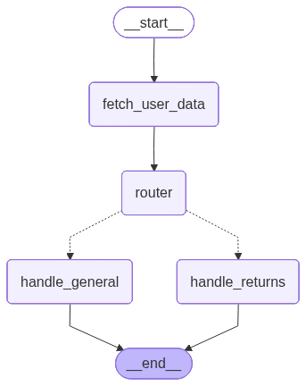

# AI & ML Ops Tech Challenge



> **🚀 Solution Completed:** This repository contains the final implementation for the AI & ML Ops Tech Challenge. An obsolete system was refactored into a **Stateful Multi-Agent Workflow** powered by *LangGraph* and *Google Gemini 2.5 Flash*.

### 📚 Exclusive Solution Documentation
To deeply understand the engineering, architecture, and scalability decisions, please refer to the following documents I have prepared:

1. 🗺️ **[Step-by-Step Flow Explanation (LangGraph)](LANGGRAPH_FLOW_EXPLAINED.md)** - *Recommended for understanding the diagram above.*
2. 🧠 **[Expansive Project Documentation](PROJECT_DOCUMENTATION.md)** - *How the 5 phases of the project were developed.*
3. 🏛️ **[Architecture and Design](deliverables/architecture.md)** - *Technical decisions and trade-offs.*
4. ☁️ **[Deployment to Production Answers](deliverables/deployment_answers.md)** - *Scaling strategies for 10,000 users, databases, and MLOps.*

---

## Original Challenge Summary

**Emporyum Tech** is a Colombian e-commerce platform offering buy-now-pay-later installment plans. In this challenge, you receive a **basic functional prototype** of an AI conversational assistant for Emporyum Tech. The prototype works end-to-end: you can ask it questions and it will answer. **But the quality is poor.** The architecture is minimal, the Knowledge Base is superficial, and the answers are vague and generic.

Your task is to **significantly improve the quality and architecture of the assistant**. How you do it — what you build, how you structure it, what design decisions you make — is entirely up to you.

## Time Estimation

**6-8 hours** for a complete solution. You don't need to finish everything — a well-designed partial solution with clear documentation is preferred over a rushed complete solution.

## Prerequisites

- Python 3.10 or higher
- [Poetry](https://python-poetry.org/docs/#installation) for dependency management
- An OpenAI API key (GPT-4o-mini or Gemini Flash is sufficient and cost-effective)

## Quick Start

Run the basic solution first. See it work. Note the issues.

```bash
# 1. Install dependencies
poetry install

# 2. Create your .env file and add your API key
cp .env.example .env

# 3. Run the interactive assistant
poetry run python tests/inline.py
```

Try these conversations and observe the responses:

| If you type | What you should notice |
|-------------|------------------------|
| `Hello!` | Generic greeting, not personalized for the user |
| `Where is my order?` | Vague answer, no specific details about the order |
| `How much do I owe in installments?` | Vague answer, no breakdown of the installments |
| `I want to return a product` | Generic single-sentence answer, no multi-step transactional flow |
| `What time is it?` | Tries to answer anyway -- no out-of-scope topic handling |

## Business Context

**Emporyum Tech** is a Colombian e-commerce platform that sets itself apart by offering installment purchases (Buy Now, Pay Later). Customers can buy products from multiple categories and split payments into monthly installments with different interest rates.

The business is organized into 4 verticals, each with its own set of rules, edge cases, and data requirements:

- **Product and Catalog** (`team_product.md`): ~290 products across 4 categories (Electronics, Home, Fashion, Beauty). Product recommendations based on user history and preferences. 5 active promotions with specific rules.

- **Payments and Installments** (`team_payments.md`): 4 payment methods (PSE, Credit Card, Efecty, Bancolombia A la Mano). Installment plans from 1 to 24 months with different interest rates. Late payment policies and amount calculations.

- **Operations and Logistics** (`team_operations.md`): Complete purchase flow from browsing to delivery. Order tracking across 6 statuses. Delivery times by city. Return and refund policies with strict eligibility rules.

- **Platform and Account** (`team_platform.md`): Account management, password reset, two-factor authentication (2FA). App features and technical troubleshooting. Security policies.

The detailed business requirements for each area are available in the `docs/stakeholder_interviews/` folder. These interview transcripts contain the specific rules, flows, edge cases, and data fields you need to consider to design the assistant's Knowledge Base and architecture.

## Project Structure

```
ai_ml_ops_challenge/
|
|-- README.md                            # <-- YOU ARE HERE
|-- pyproject.toml                       # Native project dependencies
|-- .env.example                         # Template for your API key
|-- .env                                 # You create this (not pushed to git)
|
|-- docs/
|   |-- stakeholder_interviews/          # Your main sources: business requirements
|       |-- team_product.md              #   Product team interview
|       |-- team_payments.md             #   Payments team interview
|       |-- team_operations.md           #   Operations team interview
|       |-- team_platform.md             #   Platform team interview
|
|-- source/
|   |-- __init__.py
|   |
|   |-- application/
|   |   |-- __init__.py
|   |   |-- state.py                     # GraphState TypedDict (do not modify)
|   |   |-- graph.py                     # LangGraph Topology Definition
|   |
|   |-- domain/
|   |   |-- __init__.py
|   |   |-- router.py                    # Classifier and flow initiator
|   |   |-- handle_general.py            # General orchestrator
|   |   |-- handle_returns.py            # Dedicated synchronous flow for Returns
|   |
|   |-- adapters/
|   |   |-- __init__.py
|   |   |-- chains/
|   |   |   |-- __init__.py
|   |   |   |-- general_chain.py         # Generic LLM Prompt
|   |   |   |-- router_chain.py          # Router LLM Prompt
|   |   |   |-- returns_chain.py         # Returns LLM Prompt
|   |   |-- utils/
|   |       |-- __init__.py
|   |       |-- mock_data.py             # 8 fake user profiles (do not modify)
|   |       |-- data_filter.py           # Mitigating JSON filter for tokens
|   |       |-- knowledge_base.py        # Centralization of the 4 teams' directives
|   |
|   |-- examples/                        # Framework pattern references
|       |-- README.md
|       |-- example_kb_entry.py          #   Database entry schema
|       |-- example_chain.py             #   LLM Chain with Pydantic outputs
|       |-- example_domain_function.py   #   Async domain function pattern
|       |-- example_graph.py             #   Rudimentary executable graph
|
|-- tests/
|   |-- __init__.py
|   |-- inline.py                        # CLI to dynamically test the development
|
|-- deliverables/
|   |-- architecture.md                  # Theoretical documentation of your architecture
|   |-- deployment_answers.md            # QA Deliverable for MLOps / DevOps
```

## Pre-Built Elements (Do Not Modify)

These files are provided and **must not** be modified:

| File | Description |
|------|-------------|
| `source/application/state.py` | Dictionary (`GraphState TypedDict`) defining all fields flowing through LangGraph |
| `source/adapters/utils/mock_data.py` | 8 fake user profiles with mock orders, installments, and account states |
| `source/adapters/utils/data_filter.py` | Vital utility to filter user data and inject *only* authorized variables |
| `source/examples/*` | Reference framework patterns |
| `docs/stakeholder_interviews/*` | Transcripts of the 4 leadership interviews |
| `pyproject.toml` | Native project dependencies |

## Solved Original Issues

Upon receiving the original code, it presented numerous critical flaws, which were redesigned. Among the addressed issues are:

| Original Issue | Where to look |
|----------------|---------------|
| Each question received the same generic treatment without routing | `router.py`, `graph.py` |
| Responses were vague and impersonal | `general_chain.py` |
| The Knowledge Base was superficial and fractional | `knowledge_base.py` |
| Sensitive user data was clumsily injected | `data_filter.py`, `handle_general.py` |
| The Assistant forgot what was said, preventing multi-turn processes | `handle_returns.py`, `inline.py` |

## Deliverables

1. **An improved assistant** -- The bot must demonstrate significantly better quality, organically covering the interview domains, evidencing routing, and using data with guardrails.

2. **Architecture documentation** (`deliverables/architecture.md`) -- Document with diagrams, semantic context, and exhaustive explanations of what you built and why.

3. **Deployment Answers** (`deliverables/deployment_answers.md`) -- Responses oriented to massive production from the Infra/ML Ops side.

## Evaluation Criteria

What we value, in approximate order of importance:

- **Knowledge Base Quality** -- Effectively transcribing business rules into the application.
- **Cognitive Architecture** -- Breaking down the problem using LangGraph routers with smart topology and State handling as inter-turn control variables.
- **Output Quality** -- The bot providing correct responses using personal mock data and handling deviations *(Out of scope)*.
- **Production and MLOps Focus** -- Solid, reasoned answers regarding peaks and drops in `deployment_answers.md`.
- **Solution Explanation** -- Transparency and technical accuracy when describing what was developed in `architecture.md`.

## Final Tips

1. **Read ALL 4 interview files before reviewing the code.** They are your primary source of requirements and guardrails.
2. Read `state.py` to internalize what variables circulate in the *graph* each time a step is advanced.
3. Simple and functional is better than complex and unfinished.

## Final Submission

1. Ensure that running `poetry run python tests/inline.py` executes the terminal without throwing import errors.
2. Verify that at least one complete profile flow resolves end-to-end processes.
3. Compress the entire `ai_ml_ops_challenge/` folder into ZIP format (Changing it to your name or ensuring it's a secure folder).
4. Return it.

Congratulations and excellent development!
