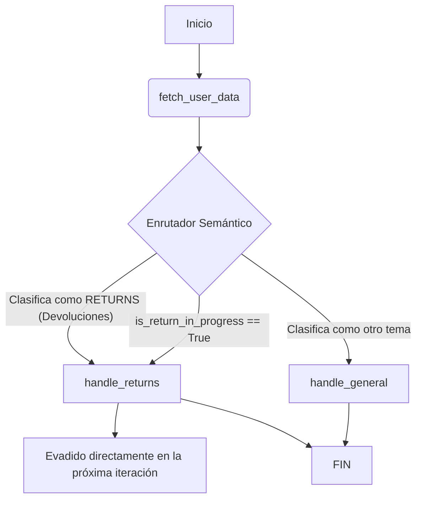

# Arquitectura del Asistente Emporyum Tech

## 1. Visión General del Sistema

El sistema fue rediseñado utilizando un modelo de agente condicional en **LangGraph** y LLMs (Google Gemini 2.5 Flash / GPT-4o-mini). La arquitectura original, que pasaba todos los datos crudos y reglas a un único nodo genérico, fue reemplazada por un enrutador robusto y nodos específicos de manejo de dominios.

### Diagrama de Flujo

## 2. Decisiones Clave de Diseño y Compromisos (Trade-offs)

### A. Enrutador Independiente (Semantic Router)
- **Decisión**: Se agregó el nodo `router.py` antes de cualquier procesamiento de generación de respuesta.
- **Razón**: Para proveer al LLM final únicamente el contexto relevante (ej. solo la política de *Pagos* cuando preguntan por cuotas), limitando las alucinaciones causadas por "sobrecarga de contexto", donde antes combinaba pagos con políticas operativas de envío.
- **Compromiso (Trade-off)**: Añade una llamada extra al LLM (mayor latencia y costo). Esto es parcialmente compensado mediante la estructuración estricta de la salida (Pydantic / Structured Output) para una inferencia rápida del enrutador.

### B. Manejo Dedicado para Flujos Multi-Paso (Flujo de Devoluciones)
- **Decisión**: Se separó el dominio de devoluciones `handle_returns.py` en un nodo dedicado con variables de máquina de estado (`current_step`, `is_return_in_progress`).
- **Razón**: La entrevista de Operaciones dictaba requerimientos muy estrictos y secuencias de validación ininterrumpidas (ej. Confirmar plazo de 15 días -> Preguntar motivo -> Programar recolección). Un agente genérico a menudo olvida preguntar el motivo antes de programar la recogida.
- **Compromiso (Trade-off)**: Requiere mantener un estado (State) del Grafo que evade el Enrutador mientras `is_return_in_progress` sea verdadero, asegurando que la respuesta contextual del usuario no despiste al enrutador a mitad de una transacción de soporte técnico.

### C. Sistema de Filtro de Datos
- **Decisión**: Se refinó `data_filter.py` para inyectar *solo* los campos obligatorios correspondientes al *tema seleccionado*. 
- **Razón**: Exponer la lista completa de direcciones de envío, correos y pedidos no relacionados consume demasiados tokens, ralentiza el modelo, aumenta los costos y supone un riesgo potencial de seguridad (Fuga de Datos e Inyección de Prompt en perfiles grandes).
- **Compromiso (Trade-off)**: Añade un sub-proceso intermedio en Python que mapea `topic_variables`. Facilita las pruebas unitarias pero centraliza la responsabilidad del flujo en la `SCENARIO_KNOWLEDGE_BASE`.

### D. Centralización de la Base de Conocimientos (KB)
- **Decisión**: Se consolidó toda la información de las 4 entrevistas en un diccionario llamado `SCENARIO_KNOWLEDGE_BASE`.
- **Razón**: Mantuvo la abstracción del código (Agentes modulares) y desacopló la lógica funcional del "contexto y políticas". Cuando se escale o rediseñe la infraestructura hacia una base de datos CMS externa (como se propuso en el entregable de MLOps), `handle_general.py` será agnóstico al origen de los prompts, mitigando fallas arquitectónicas.

## 3. Próximos Pasos Proyectados
1. Reemplazar la memoria en caché local (`MemorySaver`) por `PostgresSaver` o un adaptador nativo de Redis.
2. Inyectar Caché Semántico o una *Base de Datos Vectorial* (RAG) en lugar de un diccionario estático para soportar un rango masivo y dinámico de miles de productos de Emporyum Tech sin inflar la Ventana de Contexto (Prompt Window) con texto misceláneo extenso de reglas.
