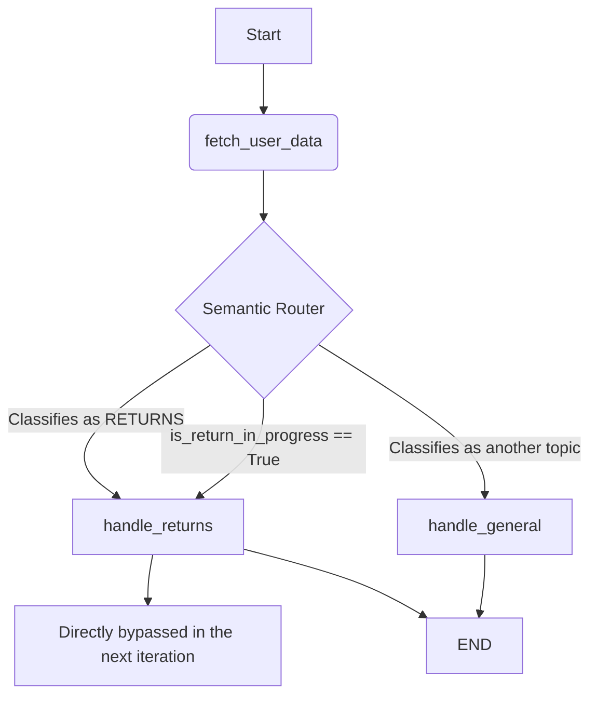

# Emporyum Tech Assistant Architecture

## 1. System Overview

The system has been re-designed using a conditional agent model on **LangGraph** and LLMs (Google Gemini 2.5 Flash / GPT-4o-mini). The original architecture, which passed all raw data and rules to a single generic node, was replaced by a robust router component and specific domain-handling nodes.

### Flow Diagram

## 2. Key Design Decisions & Trade-offs

### A. Independent Router (Semantic Router)
- **Decision**: Added the `router.py` node before any response generation processing.
- **Reason**: To provide the final LLM solely with the relevant context (e.g. only the *Payments* policy when asked about installments), limiting hallucinations caused by "context overload" where it previously combined payments with shipping operational policies.
- **Trade-off**: Adds an additional LLM call (higher latency and cost). This is partially compensated with strict output structuring (Pydantic / Structured Output) for rapid router inference.

### B. Dedicated Handling for Multi-Step Flows (Returns Flow)
- **Decision**: Separated the returns domain `handle_returns.py` into a dedicated node with state machine variables (`current_step`, `is_return_in_progress`).
- **Reason**: The Operations interview dictated very strict requirements and uninterrupted validation sequences (e.g. Confirm 15-day timeframe -> Ask for reason -> Schedule pickup). A generic agent often forgets to ask for the reason before scheduling the collection.
- **Trade-off**: Requires maintaining a Graph state that bypasses the Router as long as `is_return_in_progress` is true, ensuring the user's contextual response doesn't mislead the router in the middle of a technical support transaction.

### C. Data Filter System
- **Decision**: Refined `data_filter.py` to inject *only* the mandatory fields corresponding to the *selected topic*. 
- **Reason**: Exposing the complete list of delivery addresses, emails, and unrelated orders consumes too many tokens, slows down the model, increases costs, and poses a potential security risk (Data Leakage and Prompt Injection in large profiles).
- **Trade-off**: Adds an intermediate Python sub-process that maps `topic_variables`. Facilitates unit testing but centralizes the flow's responsibility onto the `SCENARIO_KNOWLEDGE_BASE`.

### D. Knowledge Base (KB) Centralization
- **Decision**: Consolidated all information from the 4 interviews into a `SCENARIO_KNOWLEDGE_BASE` dictionary.
- **Reason**: Maintained code abstraction (modular Agents) and decoupled functional logic from "context and policies". When scaling or redesigning infrastructure towards an external CMS database (as proposed in the MLOps deliverable), `handle_general.py` will be agnostic to the origin of prompts, mitigating architectural failures.

## 3. Projected Next Steps
1. Replace the locally cached memory (`MemorySaver`) with `PostgresSaver` or a native Redis adapter.
2. Inject Semantic Cache or a *Vector Database* (RAG) instead of a static dictionary to support a massive, dynamic range of thousands of Emporyum Tech products without bloating the Prompt Window with extensive miscellaneous rules text.
