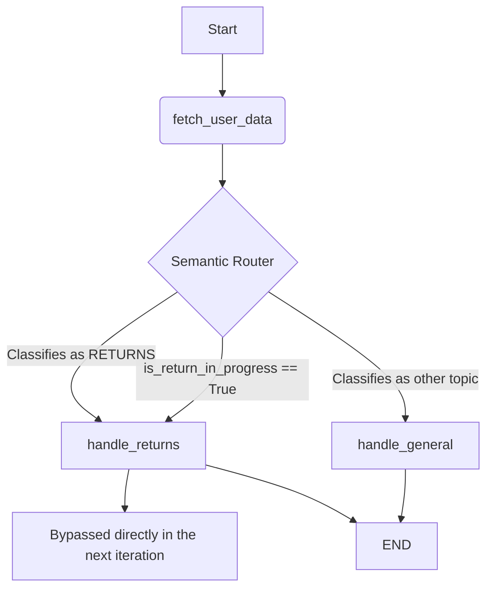

# Emporyum Tech Assistant Architecture

## 1. System Overview

The system was redesigned using a conditional agent model in **LangGraph** and LLMs (Google Gemini 2.5 Flash). The original architecture, which passed all raw data and rules to a single generic node, was replaced by a robust router and domain-specific handling nodes.

### Flowchart

## 2. Key Design Decisions and Trade-offs

### A. Independent Router (Semantic Router)
- **Decision**: Added the `router.py` node prior to any response generation processing.
- **Reason**: To supply the final LLM with only the relevant context (e.g. only the *Payments* policy when they ask about installments), limiting hallucinations caused by "context overload", where it previously combined payments with shipping operating policies.
- **Trade-off**: Adds an extra LLM call (higher latency and cost). This is partially offset by strictly structuring the output (Pydantic / Structured Output) for fast router inference.

### B. Dedicated Handling for Multi-Step Flows (Returns Flow)
- **Decision**: Separated the returns domain `handle_returns.py` into a dedicated node with state machine variables (`current_step`, `is_return_in_progress`).
- **Reason**: The Operations interview dictated very strict requirements and uninterrupted validation sequences (e.g. Confirm 15-day term -> Ask for reason -> Schedule pickup). A generic agent often forgets to ask for the reason before scheduling the pickup.
- **Trade-off**: Requires maintaining a Graph state that bypasses the Router as long as `is_return_in_progress` is true, ensuring that the user's contextual response does not mislead the router in the middle of a technical support transaction.

### C. Data Filter System
- **Decision**: Refined `data_filter.py` to inject *only* the mandatory fields corresponding to the *selected topic*. 
- **Reason**: Exposing the full list of unrelated shipping addresses, emails and orders consumes too many tokens, slows down the model, increases costs and poses a potential security risk (Data Leakage and Prompt Injection in large profiles).
- **Trade-off**: Adds an intermediate Python sub-process that maps `topic_variables`. Facilitates unit testing but centralizes flow responsibility in the `SCENARIO_KNOWLEDGE_BASE`.

### D. Knowledge Base (KB) Centralization
- **Decision**: Consolidated all information from the 4 interviews into a dictionary called `SCENARIO_KNOWLEDGE_BASE`.
- **Reason**: Kept the code abstraction (Modular agents) and decoupled the functional logic from "context and policies". When infrastructure is scaled or redesigned towards an external CMS database (as proposed in the MLOps deliverable), `handle_general.py` will be agnostic to the origin of the prompts, mitigating architectural flaws.

## 3. Projected Next Steps
1. Replace the local cache memory (`MemorySaver`) with `PostgresSaver` or a native Redis adapter.
2. Inject Semantic Cache or a *Vector Database* (RAG) instead of a static dictionary to support a massive and dynamic range of thousands of Emporyum Tech products without inflating the Context Window (Prompt Window) with extensive miscellaneous rule text.
